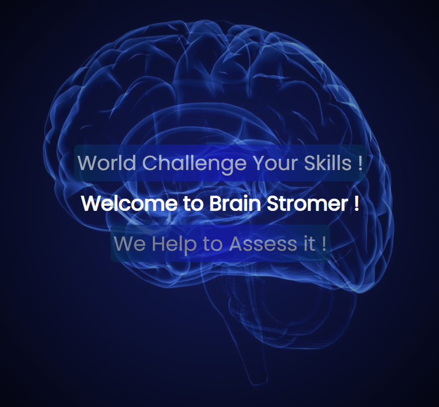
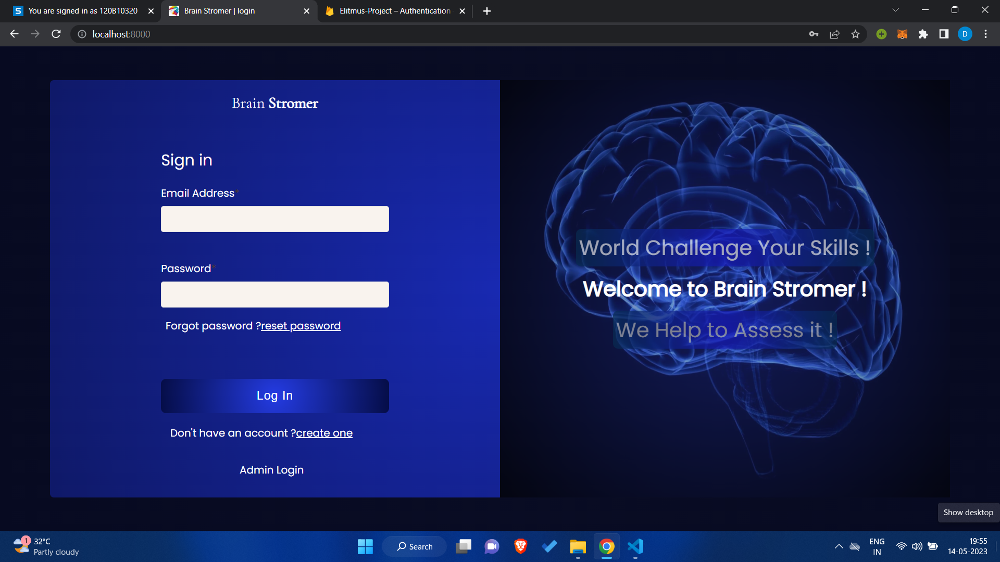
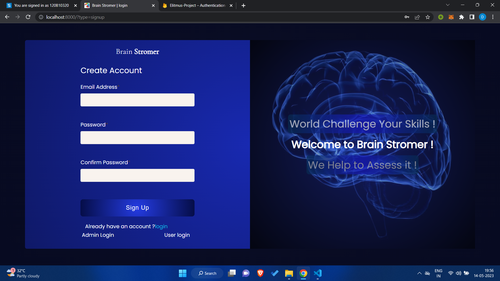
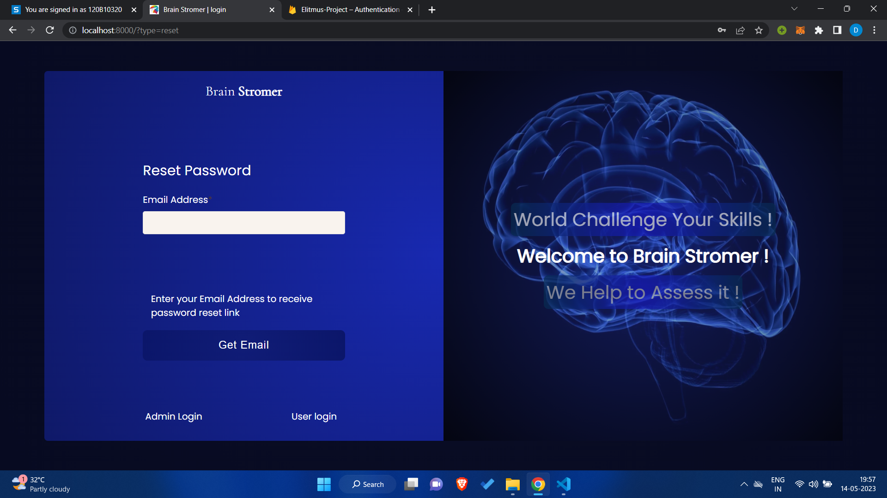
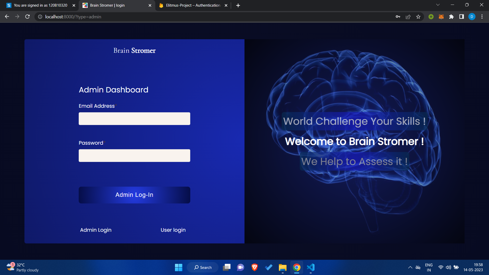
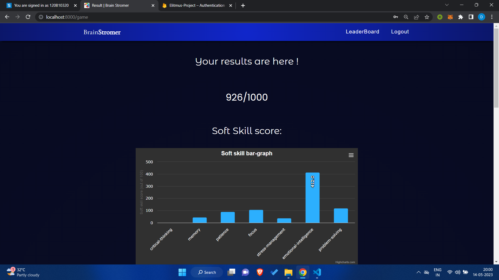
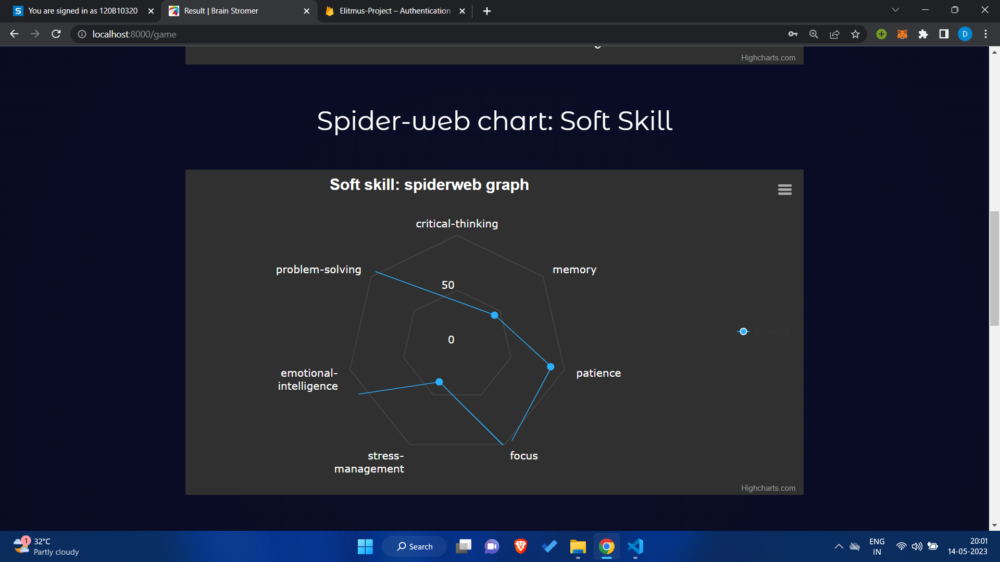
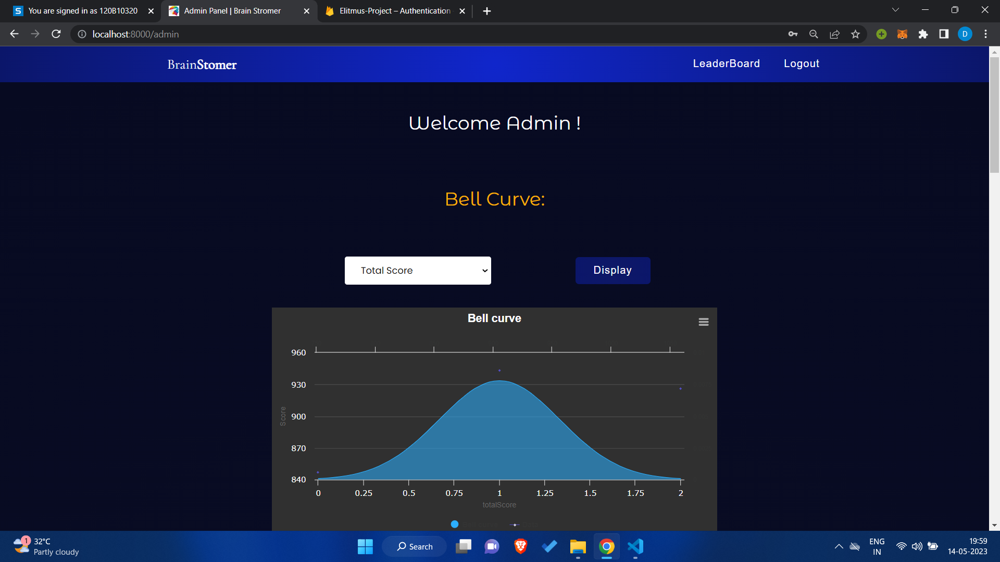
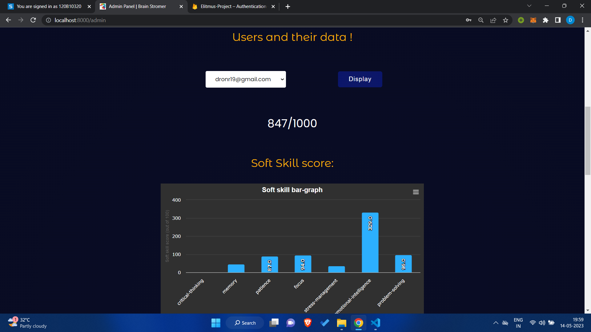
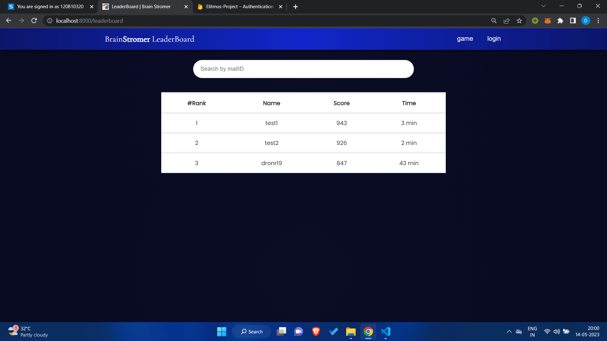

# Brain Stromer

<p align="center">
    
<br><br>
    An innovative experience that blends the thrill of a treasure hunt with the power of storytelling and puzzles to provide a one-of-a-kind soft skills assessment experience.
</p>


# Features

Listed below are all the feature included in the project

## Game Feature

- [x] 5 stages of game
    1. Word Transform 
    2. Rearrange Stones
    3. Atomic shell
    4. Combination Gain
    5. Emotions Dilemma
- [x] 8 soft skills assessed
    1. Critical Thinking
    2. Memory
    3. Patience
    4. Focus
    5. Stress Management
    6. Problem Solving
    7. Eye for Detail
    8. Emotional Intelligence
- [x] 2 dead ends
    1. First on stage 4: Combination Gain
    2. Second on stage 5: Emotions Dilemma
- [x] 7 clues
- [x] User leader board
- [x] Admin Panel
- [x] User analytics after game ends
- [x] Overall and each user's analytical in admin panel
- [x] 404 page (route not present error)
- [x] 403 page (insufficient authorization)
- [x] Ability to review previous stage information if stuck on a certain stage
- [x] **Skip** to skip a stage by discarding any points rewarded for that level
- [x] **End game** to end the game if done

- [x] Automated test with selenium to test feature functionality

## Authentication

- [x] User Sign up
- [x] User Sign in
- [x] Forgot Password (reset password via email)
- [x] admin login

## Authorization

Only logged in users can:
- [x] Play game
- [x] Access user leader board
- [x] Access result analysis
- [x] Only admin can access Admin Panel

# Screen Shots

<p align="center">
        
        <br>
        Login page
        <br><br>
        
        <br>
        signup page
        <br><br>
        
        <br>
        Reset Password
        <br><br>
        
        <br>
        Admin Login Page
        <br><br>
        
        <br>
        Result page
        <br><br>
        
        <br>
        Result page 2
        <br>
        <br>
        
        <br>
        Admin page
        <br><br>
        
        <br>
        Admin page 2
        <br><br>
        
        <br>
        leader-board
        <br><br>
</p>


# Detailed view of the game

The project has been developed as a way to test soft skills, thus it is only one time play for every user.

## Completion of the game

- The game is meant to test the soft skills, thus keeping user stuck on level forever with no form of rescue is futile.

- To avoid this *Special actions:* **skip** and **End Game**, are available at each stage so user can skip the stage by discarding the points or end the game if required.

## General Instructions for the game are as follows:

- The purpose of this game set is to evaluate your soft skills

- We recommend completing all games in one sitting, as the game is designed to be played only once

- Points are awarded for correct answers and time taken to solve each game

- The timer will not be visible on screen

- In the event of an emergency such as a power outage, technical difficulties, or network issues, you may resume the game from where you left off

- Timer will continue on the server but your progress won't be lost

- Please be attentive to all information presented in the game

- If you find yourself at a dead end, you can choose to review the previous stage, which may provide clues to help you progress past the current stage

- If necessary, you have the option to skip a stage, though this will result in forfeiting any potential points for that stage

- You may end the game at any time, regardless of what stage you are on and receive results till there

# Stage 1: Word Transform 

## Soft skills tested: 3

1. Problem Solving
2. Critical Thinking
3. Eye For Detail

## Dead end: 0

## Clues: 3

The mapping follows the pattern **2, 0, 8, 6,4, 6** and repeats. That is the unit digit of atomic number of noble gases.

1. Name of the stage is "Word Transform ", octet as in the one in Ghostry.
2. Initial pattern is hidden in the story, as numbers that appear, "two product" -> 2, "midnight" is when clock hits -> 0, "minute hand at 8" ->8

## Story
```
After the exams, You and Your friend Ben ventured into a nearby jungle to explore nature.Jungle encountered mysterious occurrences, and in the panic, Ben fell into a hidden pit. To your surprise, a ghost appeared before You, offering to free Ben (if and only if you could answer the puzzle correctly) .

Ghost  offered you to answer a series of puzzle correctly. With determination, You accepted the challenge, solving the ghost's puzzles one by one. As each riddle was solved, the ghost's form weakened, until
finally, Beb was rescued from the pit.

To release your friend , you need to solve the puzzle first ! 
```

## Puzzle

Some characters are mapped to another i.e. encrypted to decrypted. Identify the pattern between these mapping and form you own key for the given string.

## Solution

<details> 
  <summary>Beware solution below, click to see? </summary>
  litmus 
</details>

## Motive

This stage aims to establish the story and characteristics of the agents involved.
This is base test to assess problem solving and feed user details that will come in handy in later stages that if ignored will lead to possible dead ends.

<br>

# Stage 2: Rearrange Stones

## Soft skills tested: 2

1. Problem Solving
2. Memory

## Dead end: 0

## Clues: 2

In the note presented in this stage story, two clues are hidden that are used to set premise of Ghost to release your friend Ben.
Since existence of this note points to this being a recurring event.

**Note by Ghost:**

1. No experimenting with new formulas tonight!
2. Don't listen to what you've consumed, you can recover 

## Story
```
After answering the last puzzle, Ghost assigned you the new task of rearranging the Stones accoring to the position he told to you  ..
The given stones are begin in the random order .You have to arrange them in the correct order

The Stones are named as the English alphabet (A,B...Z) (Dont consider is as order of alphabet it can defer ):

1. Don't touch the other things , for need to be focused !
2. Remember, the order matters! Don't mess it up
3. If the stones look similar arrange them in the order you want but the order of the stone should be according to the smallest position first

Follow the given instructions and figure out the correct order. 
```

## Puzzle

Arrange the Stones according to their position as mentioned in the game .
The stones can be of same and different size

## Solution

<details> 
  <summary>Beware solution below, click to see? </summary>
  G,C,F,H,A,I,D,B,E
</details>

## Motive

This stage is design to assess memory and deduction skills of the user.

<br>

# Stage 3: Atomic Shell

## Soft skills tested: 2

1. Patience
2. Focus

## Dead end: 0

## Clues: 1

1. The story mentions a satisfactory score, never a exact number.

## Story

```
While a moment, the Ghost was frenziedly  You about talking about his favorite game, Circular Mania. Ghost insists that you beat his current high score before and defeat him.

Play the game and achieve a satisfactory score to release your friend.
```

## Puzzle

Comprehend the story accurately and make decision about at what score should you leave.

## Solution

Submitting whenever is fine, early is better.

## Motive
The story mentions a satisfactory score, never a exact number, thus submitting at any point is okay. 
This can only be comprehended if user if focused.


# Stage 4: Combination Gain

## Soft skills tested: 4

1. Memory
2. Stress Management
3. Focus
4. Patience

## Dead end: 1

- The value that appears on the face of particals follows the sequence seen in game 1.
- If user is stuck here, they will have to move back to round one info
- This action will cost time for the user and thus affect points negatively.

## Clues: 0

## Story

```
Having finally beaten the Ghost high score, you successfully completed that puzzle. 
The next step requires combining the Clay particals on the ground to make two toys (car & pencil)
```

## Puzzle

1. Every appearing partical has amount/count written on it's face that is the amount of partical you will gain.
2. Your current collection amount won't be shown on the screen.
3. Once you are sure that you have collected the necessary amount, hit
Collecting more than given amount will result in incorrect attempt.
4.When Making, Partical the toy may break might , beware !

## Solution

Focus on collecting one Partical first then move to next

## Motive

The game is designed to put user under stress and then check their focus and short term memory.

<br>

# Stage 5: Emotions Dilemma

## Soft skills tested: 2

1. Eye for Detail
2. Emotional Intelligence

## Dead end: 1

- All questions asked here are related to note found in game two.
- If user is stuck here, they will have to move back to round two info
- This action will cost time for the user and thus affect points negatively.

## Clues: 1

- As the name suggests "Emotions Dilemma", use should be mindful of what they answer

## Story

```
Now that Ben is released its time to say goodbye to the ghost  🥲.
              
You need to answer some questions releated to the Ghost (Admin want to know 😎) 
```

## Puzzle

Answer the Questions to best of your knowledge about Ghost.

## Solution

- Q1: yes
- Q2: no
- Q3: yes
- Q4: should be same as 8th answer
- Q5: yes
- Q6: should be same as 7th answer
- Q7: should be same as 6th answer
- Q8: should be same as 4th answer

## Motive

Q1 to Q3 are there to check users attention, others are to assess Emotional Intelligence.

There are 3 methods to check Emotional Intelligence: "self-reporting, other-reporting, and ability testing".

While conducting this game, **Self reporting** is the most suitable method to do so.

Initially we ask some obvious Questions that user should be able to answer easily if they paid attention to story.

This sets up the pace for our crucial questions that are in pair (4 and 8) and (5 and 7).

(4 and 8) asks the Question on whether user got to know about  Ghost. Whether they do or not is up to them but a difference in answer suggests users incapacity to understand their emotion about the Ghost.


With these Qs we attempting to assess Emotional Intelligence of the user.

<br>

# Tech stack:

## Frontend


## Backend


## Database and Authentication


## Hosting 


# Project Set-up
## Install Node
- #### Node installation on Windows

  Just go on [official Node.js website](https://nodejs.org/) and download the installer.
Also, be sure to have `git` available in your PATH, `npm` might need it (You can find git [here](https://git-scm.com/)).

- #### Node installation on Ubuntu

  You can install nodejs and npm easily with apt install, just run the following commands.

      $ sudo apt install nodejs
      $ sudo apt install npm

## Install Project

    $ git clone 
    $ cd BrainStromers
    $ npm install

## Configure Project

This project uses Firebase technology, to configure this project for your self create project on firebase and replace credentials at required locations

<br>

# Credits
- izitoast: https://izitoast.marcelodolza.com/
- Charts: https://www.highcharts.com
- Story Images: From [Gencraft Ai](https://gencraft.com/generate)
